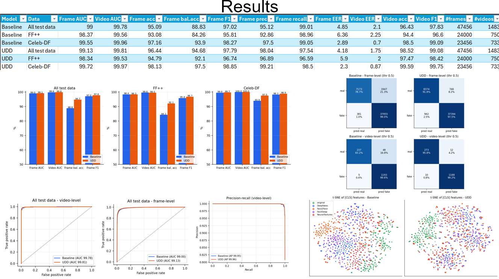

# Unbiased Deepfake Detection (UDD) — Replication

## 1. Paper Being Replicated

**Title:** Exploring Unbiased Deepfake Detection via Token-Level Shuffling and Mixing (UDD)
**Authors:** Fu et al.
**Venue:** AAAI 2025
**arXiv:** [2501.04376](https://arxiv.org/abs/2501.04376)

## 2. Architecture

The paper identifies two biases that hurt deepfake-detector generalization: **position bias** and **content bias**. UDD is a plug-and-play ViT-based detector with three forward branches per image:

1. **Original branch**: normal ViT forward pass (CLIP ViT-B/16, `vit_base_patch16_clip_224.openai` backbone, LoRA fine-tuning).
2. **Shuffling branch** (intervenes on position bias): patch content tokens are permuted in 2×2 blocks; position embeddings are replaced by a random crop (area 60–196 grid cells, aspect ratio 3/4–4/3) of the 14×14 position-embedding grid, bilinearly resized back. The CLS token and its position embedding are untouched. (Paper Eq. 2: `t_i = pos'_i + e_pi(i)`)
3. **Mixing branch** (intervenes on content bias): after a random transformer block chosen from the mid stage (blocks 5–8 of 12), 30% of a sample's patch tokens are swapped with the tokens of a same-label partner from the batch. The CLS token is never swapped. (The paper found mid-stage mixing works best, vs. mixing before block 1.)

**Losses** (paper Eq. 5–8):
- Cross-entropy on all three branches (original, shuffled, mixed).
- `L_con`: SimCLR-style InfoNCE contrastive loss between a 3-layer MLP projection of (original, shuffled) and (original, mixed) features, temperature 0.1.
- `L_align`: Jensen-Shannon divergence between the softmax outputs of (original, shuffled) and (original, mixed).
- `L_total = CE_orig + CE_shuf + CE_mix + 0.1 * L_con + 0.1 * L_align`.
- Gradients flow through all three branches; no stop-gradient (paper design choice).

## 3. Resources Required

See the official dataset page.

## 4. Code Setup, Training, and Evaluation

> **Note:** All training and evaluation were run in Kaggle Notebooks (T4 and A100-class GPUs). File paths referenced inside the original Kaggle notebooks (e.g. `/kaggle/input/...`, `/kaggle/working/...`) will differ from the actual repo structure below — adapt paths to your own environment/local clone.

### 4.1 Clone and install

```bash
git clone https://github.com/prince12568/Unbiased-DeepFake-Detection.git
cd Unbiased-DeepFake-Detection
pip install -r requirements.txt
```

### 4.2 Dataset preprocessing

Datasets used: **FaceForensics++** and **Celeb-DF (v2)**. See the official dataset page for access/download.

**FaceForensics++ preprocessing:**

```bash
python preprocess_ff_chunked.py \
    --base_url <redacted> \
    --output_root <output folder> \
    --datasets original Deepfakes Face2Face FaceSwap NeuralTextures \
    --compression c23 \
    --chunk_size 10 \
    --frames_per_video 32 \
    --face_size 224
```

**Celeb-DF preprocessing** (`preprocess_cdf_chunked.py`): adapted from an earlier Colab notebook pipeline into a standalone script for this repo. For each video it samples 64 frames (evenly spaced first, then random backups), detects the largest confident face per frame with `facenet-pytorch`'s MTCNN (thresholds `[0.6, 0.7, 0.7]`, min face size 40, min confidence 0.95), crops a square region around the face with a 30% margin (padding if the crop goes out of frame), resizes to 224×224, and saves as JPEG (quality 95). Categories are mapped to labels as `Celeb-real` → real, `YouTube-real` → real, `Celeb-synthesis` → fake, and a `manifest.csv` listing all extracted face images is produced.

```bash
python preprocess_cdf_chunked.py \
    --input_root <path to Celeb-DF raw videos> \
    --output_root <output folder> \
    --num_frames 64 \
    --face_margin 0.3 \
    --img_size 224 \
    --jpeg_quality 95 \
    --min_face_size 40 \
    --min_confidence 0.95
```
*(Flag names above are inferred from the script's described logic — confirm against `preprocess_cdf_chunked.py --help` if they differ.)*

**Combine datasets and generate split files:**

```bash
python prepare_dataset.py
```

This combines the preprocessed CelebDF and FaceForensics++ outputs (kept together under `udd_dataset/`) and generates `udd_dataset/dataset_relative.csv` and `udd_dataset/dataset_split_relative.json`. Check [`prepare_dataset.py`](https://github.com/prince12568/Unbiased-DeepFake-Detection/blob/main/prepare_dataset.py)'s argparse for any additional flags relevant to your setup.

**Scan for unreadable/corrupt images:**

```bash
cd princeh01/kaggle/working/udd_baseline
python scan_images.py
```

This produces `bad_files.txt` in the same working directory.

### 4.3 Baseline training

Code: `princeh01/kaggle/working/udd_baseline/` (`train.py`, `model.py`, `data.py`, `scan_images.py`). Outputs (`best.pt`, `last.pt`, `history.json`, `test_results.json`) are saved in this same folder. 64 frames per video were used for the baseline.

```bash
python train.py \
    --epochs 15 \
    --warmup_epochs 1 \
    --bad_list /kaggle/working/bad_files.txt \
    --data_root <path to udd_dataset/> \
    --split_json <path to udd_dataset/dataset_split_relative.json> \
    --out_dir <your output dir>
```

### 4.4 UDD (full) training

Code: `udd_full/udd_full/` (`train_udd.py`, `model.py`, `data.py`, `shuf_branch.py`, `mix_branch.py`, `losses.py`, `scan_images.py`). Outputs (`best.pt`, `last.pt`, `history.json`, `test_results.json`) are saved in this same folder.

```bash
python train_udd.py \
    --epochs 15 \
    --warmup_epochs 1 \
    --data_root <path to udd_dataset/> \
    --split_json <path to udd_dataset/dataset_split_relative.json> \
    --bad_list <path to bad_files.txt> \
    --out_dir udd_full/udd_full
```

Implementation notes:
- Backbone: `vit_base_patch16_clip_224.openai` (CLIP ViT-B/16), LoRA fine-tuning (`lora_rank=4`).
- Trained using `nn.DataParallel` across 2× T4 GPUs: 32 images/GPU, effective batch size 64 (falls back to batch 32 × grad-accum 2 on a single GPU). Pass `--no_dp` to disable DataParallel.
- `mix_ratio=0.30`; mixing happens after a random block in the range 5–8 (mid stage).
- Before the full 15-epoch run, the following validation steps were run: (a) unit tests on `shuf_branch.py`, `mix_branch.py`, `losses.py`; (b) an equivalence check confirming that with shuffling/mixing disabled the branches reproduce the normal forward pass exactly; (c) a 1-epoch smoke test on 40 videos.

### 4.5 Evaluation

Code: `evaluation/` (`eval_core.py`, `run_eval.py`, `make_plots.py`). Outputs are saved to `udd_eval_results/`.

**1. Compute metrics for both models:**

```bash
python run_eval.py --stage metrics \
    --models Baseline=<path to udd_baseline/best.pt> UDD=<path to udd_full/udd_full/best.pt> \
    --data_root <path to udd_dataset/> \
    --split_json <path to udd_dataset/dataset_split_relative.json> \
    --bad_list <path to bad_files.txt> \
    --out_dir <output dir>
```

**2. Generate additional analyses (cutout robustness, robustness curves, t-SNE, attention maps, Grad-CAM):**

```bash
python run_eval.py --stage cutout robust tsne attention gradcam \
    --models Baseline=<path to udd_baseline/best.pt> UDD=<path to udd_full/udd_full/best.pt> \
    --data_root <path to udd_dataset/> \
    --split_json <path to udd_dataset/dataset_split_relative.json> \
    --bad_list <path to bad_files.txt> \
    --out_dir <output dir>
```

**3. Generate all plots and the training-history comparison:**

```bash
python make_plots.py \
    --out_dir <output dir> \
    --histories Baseline=<path to udd_baseline/history.json> UDD=<path to udd_full/udd_full/history.json> \
    --epochs 15 --warmup_epochs 1
```

Output includes `summary_table.md`/`.csv`, a full set of plots (ROC curves, confusion matrices, score histograms, PR curves, summary bars, loss curves, etc.), attention maps, Grad-CAM heatmaps, and t-SNE visualizations of CLS features for both models — see `udd_eval_results/plots/` in the repo.

## 5. Results



UDD performs roughly on par with, or slightly ahead of, the baseline across all test splits (All test data, FF++, Celeb-DF), with similar trends visible across frame/video-level AUC, accuracy, ROC curves, and the t-SNE separation of real/fake clusters.

## 6. Authors

- Shlok Divyam (B24CS042)
- Prince Hadke (B24DS022)
